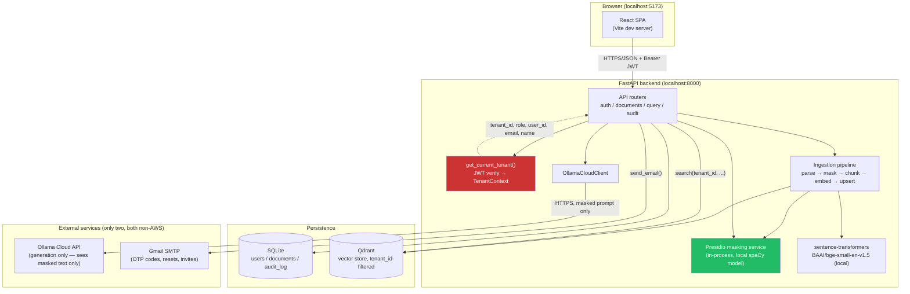
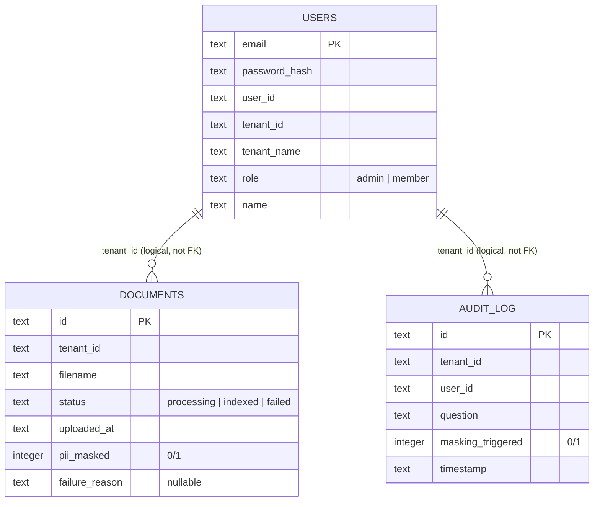

# SecureRAG — Handoff Doc

This is a cold-start handoff for anyone (human or LLM) picking up this codebase with zero prior context. It explains what the system is, how every piece connects, and how data actually flows end to end. Read this before touching code.

## 1. What this is

A multi-tenant RAG (Retrieval-Augmented Generation) Q&A system built for a case study ("Secure Document Query System Using RAG Pipeline") whose graded requirements are:

1. **Strict multi-tenant data isolation** — one organization must never be able to see, search, or leak another organization's documents, even accidentally.
2. **PII/secret masking** — sensitive content (names, emails, SSNs, credentials, client IDs, etc.) must never reach the LLM or the end user unmasked.
3. **No AWS** — every piece runs locally / self-hosted or via a non-AWS cloud API (Ollama Cloud for generation only).

Everything else (auth, org/employee model, UI polish) exists in service of demonstrating those two properties convincingly in an interview setting.

**The one rule that overrides all others in this codebase:** tenant identity is *always* derived server-side from a verified JWT, never from any client-supplied field. Every DB query and every Qdrant call is filtered by `tenant_id` sourced from `TenantContext` (see [§5](#5-tenant-isolation-the-hard-rule)). If you're ever tempted to add a code path that takes `tenant_id` as a request parameter instead of pulling it off the authenticated context, don't — that's the exact class of bug this whole architecture exists to prevent.

## 2. Tech stack

| Layer | Choice | Why |
|---|---|---|
| Backend framework | FastAPI, Python 3.13 | async, typed, dependency-injection-friendly |
| Package manager | `uv` (`backend/uv.lock`) | fast, lockfile-based reproducible installs |
| Metadata storage | SQLite (`backend/app/storage/db.py`) | survives `uvicorn --reload` restarts; zero ops |
| Vector store | Qdrant (Docker, self-hosted) | payload-filtered ANN search — filtering is the isolation mechanism |
| Embeddings | `sentence-transformers` — `BAAI/bge-small-en-v1.5` | runs locally, no API key, no data leaves the box to embed |
| PII/secret masking | Microsoft Presidio (`presidio-analyzer` + `presidio-anonymizer`), in-process, local spaCy model (`en_core_web_sm`) | no network call to mask — nothing sensitive ever leaves the backend for this step |
| LLM generation | Ollama Cloud, `gpt-oss:20b-cloud` | the *only* external network call in the whole pipeline, and it only ever sees already-masked text |
| Auth | PyJWT + Argon2 (`argon2-cffi`) | stateless bearer tokens, industry-standard password hashing |
| Email | SMTP (Gmail) via `backend/app/notifications/mailer.py` | OTP codes, password reset, invites |
| Frontend | React 19 + Vite + TypeScript 6, Tailwind v4 | SPA, CSS-variable theming (light/dark) |
| Frontend data/state | `@tanstack/react-query`, React Context (`AuthContext`) | server-state caching + auth state |
| Testing | pytest (backend), Vitest (frontend unit), Playwright (E2E) | |
| CI | GitHub Actions + SonarQube Cloud | lint/type-check/test/coverage/security gate |

## 3. Architecture



Key properties this diagram is trying to make legible:

- **Only one external network call carries document content**: the Ollama Cloud generation request — and by the time a prompt reaches it, the retrieved chunks have already been masked twice (at ingestion, and again at retrieval — see [§6](#6-pii-masking-defense-in-depth)).
- **Every arrow into SQLite or Qdrant from `API` is implicitly tenant-scoped** — there's no code path that queries either store without a `tenant_id` filter.
- The frontend never talks to Qdrant, Presidio, Ollama, or SMTP directly — it only ever talks to the FastAPI backend.

## 4. Request lifecycle (how a call actually gets tenant-scoped)

```
Browser → Authorization: Bearer <jwt> → FastAPI route
                                              │
                                    tenant: CurrentTenant  (a FastAPI Depends alias)
                                              │
                          app/auth/dependencies.py: get_current_tenant()
                                              │
                        1. HTTPBearer extracts the raw token
                        2. decode_access_token() (app/auth/jwt.py) verifies signature + exp
                           (this is the local wrapper around PyJWT — not jwt.decode() directly)
                        3. Builds TenantContext(user_id, tenant_id, tenant_name, role, email, name)
                                              │
                          Route handler uses tenant.tenant_id for every
                          SQL WHERE clause and every Qdrant Filter — never
                          anything from the request body.
                          Role-specific routes additionally check tenant.role:
                          • POST /documents, DELETE /documents/{id} → 403 if role != "admin"
                          • POST /auth/invite → 403 if role != "admin"
```

`CurrentTenant` (`backend/app/auth/dependencies.py`) is a shared `Annotated[TenantContext, Depends(get_current_tenant)]` alias — every protected route just declares `tenant: CurrentTenant` as a parameter and gets a verified, typed identity object for free. This is the *only* object any downstream code should trust for "who is this and which org do they belong to."

## 5. Tenant isolation — the hard rule

Two systems store tenant-scoped data, and both enforce isolation the same way: a mandatory `tenant_id` filter with no bypass.

- **SQLite** (`documents`, `audit_log` tables): every query is `WHERE ... AND tenant_id = ?`. There is no "admin" query that omits it.
- **Qdrant** (`backend/app/retrieval/vector_store.py`): `tenant_id` is an **indexed payload field** (`PayloadSchemaType.KEYWORD`), and `upsert`/`search`/`delete_document`/`get_document_chunks` all take `tenant_id` as a **required positional argument** with no default. The tenant filter is pushed into the HNSW search itself via `Filter(must=[FieldCondition(key="tenant_id", ...)])` — not a slow, leaky post-filter applied after the fact. This is the single piece of the whole system a grader is most likely to specifically test (e.g., "can tenant B guess tenant A's `document_id` and read/delete it?" — no, because `delete_document`/`get_document_chunks` filter on `tenant_id` AND `document_id` together).

Two tenants exist out of the box as demo seed data (`backend/app/auth/users.py`, re-inserted idempotently via `INSERT OR IGNORE` on every DB connection):

| Email | Password | Org | Role |
|---|---|---|---|
| `alice@acme.example` | `acme-demo-pass` | Acme Corp (`tenant-acme`) | admin |
| `bob@globex.example` | `globex-demo-pass` | Globex Inc (`tenant-globex`) | admin |

## 6. PII masking — defense in depth

Presidio (`backend/app/masking/presidio_service.py`) is the single shared masking implementation, called from three places:

1. **Ingestion** (`backend/app/ingestion/pipeline.py`) — masks the *entire extracted document text* before chunking (full-document context gives Presidio's NER better accuracy than isolated chunk fragments), then only the *masked* text is chunked, embedded, and stored in Qdrant. The original unmasked text is never persisted anywhere.
2. **Retrieval** (`backend/app/api/query.py`) — re-masks every retrieved chunk before it goes into the LLM prompt. Redundant with #1 in the common case, but catches anything that slipped through at ingestion time (different masking config, a recognizer bug, etc.).
3. **Output** (`backend/app/api/query.py`) — re-masks the LLM's generated answer before returning it to the user, in case the model reconstructed something sensitive from context it was given.

Recognizers in play (`backend/app/masking/recognizers.py`):
- Presidio's built-ins (person names, SSNs, credit cards, phone numbers, etc.)
- `DATE_TIME` is **deliberately excluded** — it was masking ordinary durations like "30 days" in refund-policy text, degrading answer quality for non-PII content.
- `CLIENT_ID` — custom regex for `CID-NNNNN`-style identifiers.
- `SECRET` — custom regex for `password:`/`api_key:`/`secret:`/`token:` style key-value lines.
- `EMAIL_ADDRESS` fallback — Presidio's built-in email regex misses uncommon/long TLDs (e.g. `x@acme-corp.example`); a permissive backstop pattern reuses the same `EMAIL_ADDRESS` entity type so it doesn't produce a second differently-labeled finding for the same span.

Masking is 100% local — Presidio runs in-process against a local spaCy model. No document content is sent anywhere to be masked.

## 7. Database schema



Notes:
- There are **no SQL foreign keys** — `tenant_id` is a plain string shared across tables, not an enforced relationship. Isolation is enforced in application code (every query filters on it), not by the schema.
- `users.email` is the primary key. `set_email()` updates it in place; every other table keys off `user_id`/`tenant_id`, so an email change never orphans documents or audit rows.
- Schema is created via `CREATE TABLE IF NOT EXISTS` plus a `_migrate()` step (`backend/app/storage/db.py`) that does idempotent `ALTER TABLE ADD COLUMN` for columns added after the original schema (`role`, then `name`) — this is how the DB file survives being created by an older version of the code without needing a migration tool.
- Storage lives at `./data/app.db` (`settings.database_path`) by default — gitignored, not committed.

**Qdrant isn't a SQL schema, but its payload shape is load-bearing.** Each point in the `documents` collection (`settings.qdrant_collection`) looks like:

```json
{
  "id": "<uuid>",
  "vector": [0.0134, -0.0821, ...],          // 384-dim, BAAI/bge-small-en-v1.5, cosine
  "payload": {
    "tenant_id": "tenant-acme",              // indexed (KEYWORD) — the isolation filter
    "document_id": "<uuid>",                 // groups chunks back to one SQLite documents row
    "chunk_index": 0,
    "text": "<masked chunk text>",
    "filename": "policy.pdf"
  }
}
```

There is deliberately no unfiltered read path into Qdrant — `search`, `delete_document`, and `get_document_chunks` all require `tenant_id` (and the latter two also require `document_id`) as mandatory arguments.

**In-memory-only stores** (not in SQLite, reset on every backend restart — a known limitation, acceptable for a prototype): `backend/app/auth/reset_tokens.py`, `signup_otp.py`, `email_change_otp.py`. Each is a simple dict keyed by token/email/user_id with a TTL (10–30 min), holding single-use codes for password reset, signup email verification, and email-change verification respectively. If the backend restarts mid-flow (e.g. `uvicorn --reload` picks up a code change while a user is mid-signup), any pending OTP/reset token is lost and the user must request a new one.

## 8. User flow

```mermaid
flowchart TD
    Start(["Visitor"]) --> HasAccount{"Has an account?"}

    HasAccount -- "No, new org" --> Signup["Sign up form:<br/>org name, email, password, full name"]
    Signup --> ReqOtp["POST /auth/signup/request-otp<br/>(hashes password, stashes it + org name<br/>in-memory keyed by email, emails a 6-digit code)"]
    ReqOtp --> EnterOtp["User enters code from email"]
    EnterOtp --> VerifyOtp["POST /auth/signup/verify-otp<br/>creates tenant + admin user in SQLite,<br/>issues JWT"]
    VerifyOtp --> AskPage

    HasAccount -- "Yes" --> Login["Login form"]
    Login --> LoginCall["POST /auth/login<br/>Argon2 verify → JWT<br/>(sub, tenant_id, tenant_name, role, email, name)"]
    LoginCall --> RoleCheck{"role?"}
    RoleCheck -- "admin" --> Documents["Documents page"]
    RoleCheck -- "member" --> AskPage["Ask a Question page<br/>(only page members can access)"]

    HasAccount -- "Forgot password" --> Forgot["POST /auth/forgot-password<br/>(always 202, doesn't reveal if email exists)"]
    Forgot --> ResetEmail["Emailed reset link (30 min TTL)"]
    ResetEmail --> ResetForm["POST /auth/reset-password"] --> Login

    Documents --> Upload["Upload document — admin only<br/>POST /documents (multipart)<br/>403 if role=member"]
    Upload --> BgTask["Background task:<br/>parse → mask (Presidio) → chunk → embed → upsert to Qdrant<br/>status: processing → indexed | failed"]
    Documents --> Preview["Preview modal<br/>GET /documents/{id}/preview<br/>(shows masked indexed text, never original)"]
    Documents --> Delete["Delete — admin only<br/>DELETE /documents/{id}<br/>403 if role=member"]

    Documents --> Ask
    AskPage --> Query["POST /query"]
    Query --> SmallTalk{"Small talk?<br/>(hi/hello/who are you/...)"}
    SmallTalk -- yes --> FriendlyReply["Canned friendly intro,<br/>no retrieval, logged to audit"]
    SmallTalk -- no --> Retrieve["embed question → Qdrant search<br/>(tenant-filtered, score ≥ 0.35)"]
    Retrieve --> ReMask["Re-mask retrieved chunks"]
    ReMask --> HasChunks{"Any relevant chunks?"}
    HasChunks -- no --> NotFound["'Nothing found in your org's docs' answer"]
    HasChunks -- yes --> Generate["Build prompt → Ollama Cloud generate"]
    Generate --> OutMask["Re-mask generated answer"]
    OutMask --> ShowAnswer["Answer + deduped source citations shown"]
    NotFound --> AuditWrite
    ShowAnswer --> AuditWrite["Audit log entry written<br/>(question + masking_triggered flag only —<br/>never raw chunk text or the answer)"]

    Documents --> AuditPage["Audit Log page — admin only<br/>GET /audit-log (tenant-scoped)"]

    Documents --> SettingsPage["Settings page — admin only"]
    SettingsPage --> ChangePw["Change password<br/>(must re-enter current password)<br/>POST /auth/change-password"]
    SettingsPage --> ChangeEmail["Change email —<br/>POST /auth/change-email/request-otp<br/>(re-enter password, code sent to NEW address)<br/>→ POST /auth/change-email/verify-otp<br/>→ new JWT issued"]
    SettingsPage --> MembersLink["\"Manage members\" button → /org/members"]

    MembersLink --> OrgMembers["Organization Members page — admin only<br/>POST /auth/invite (name, email, password)<br/>joins the SAME tenant as role=member,<br/>active immediately — no email/OTP step"]
    OrgMembers --> Documents
```

Things worth calling out that aren't obvious from the diagram alone:

- **There is no public self-signup for employees.** The only way a new *tenant* (organization) is created is the signup-OTP flow, and the signer always becomes `role=admin`. Every other member of that org is added via `/auth/invite` (admin-only, from the **Organization Members** page at `/org/members`), joins the *same* `tenant_id`, gets `role=member`, and can immediately sign in with the credentials the admin set — no email/OTP step for them.
- **Members are strictly read-query-only.** After login, members land on `/ask` and see only that page in the nav. They cannot access Documents, Audit Log, Settings, or the Members page. Attempting to navigate there directly redirects them to `/ask`. Upload and delete endpoints also return `403` at the backend level — the frontend restriction is just UX.
- **Small talk never touches retrieval, masking-on-output, or the LLM** — it's a pure regex short-circuit (`backend/app/api/query.py`, `_SMALL_TALK`) that exists purely so "hi" doesn't produce a cold refusal with bogus source citations. It still gets logged to the audit trail.
- **Sources are deduplicated by `document_id`** before being returned, so multiple chunks from the same document (or repeated uploads of a similarly-named file) don't show the same citation multiple times.
- **The masking-sensitivity selector on the Settings page is UI-only right now** — it doesn't yet call any backend endpoint (there's a `Save changes` button but no wired mutation). If you're asked to extend this, that's the obvious next real feature, not a bug to "fix" silently.

## 9. Frontend structure

- **Routing** (`frontend/src/App.tsx`): `/login`, `/signup` are wrapped in `RedirectIfAuthenticated` (bounces an already-logged-in user straight into the app instead of showing the login form). Protected routes are layered in two tiers:
  - `RequireAuth` — any authenticated user (admin or member). Currently only `/ask` and the root `/` redirect.
  - `RequireAdmin` (`frontend/src/auth/RequireAdmin.tsx`) — admin role only; wraps `/documents`, `/audit-log`, `/settings`, and `/org/members`. Members navigating to any of these are silently redirected to `/ask`.
  - The root `/` always redirects to `/ask`, which works for both roles (admins then navigate from the full sidebar).
- **Role-based navigation** (`frontend/src/components/Layout.tsx`): the sidebar nav is derived from role at render time.
  - `ADMIN_NAV_ITEMS`: Documents, Ask a Question, Audit Log, **Members** (`/org/members`), Settings.
  - `MEMBER_NAV_ITEMS`: **Ask a Question only.**
  Members never see links they can't use — the `RequireAdmin` route guard is a belt-and-suspenders backstop, not the primary UX control.
- **Auth state** (`frontend/src/auth/AuthContext.tsx`): the JWT is decoded client-side (`decodeToken`) purely to read display claims (`tenant_name`, `role`, `email`, `name`) — the token itself is only ever *verified* server-side; the frontend never trusts its own decode for authorization decisions, only for what to render. Stored in `localStorage`. Two listeners keep this state honest:
  - `pageshow` (`event.persisted`) — re-syncs from `localStorage` when the browser restores a bfcache snapshot on back/forward navigation, since React's in-memory state would otherwise stay frozen from before the navigation (this was the "back button shows stale login state" security bug).
  - `storage` — keeps multiple tabs consistent (logging out in one tab reflects in others).
- **Theme** (`frontend/src/index.css` + inline `<script>`/`<style>` in `frontend/index.html`): CSS-variable-based light/dark theme keyed on a `data-theme` attribute. The inline pre-paint script exists specifically to avoid a flash-of-wrong-theme on refresh, since Vite's dev server loads the real stylesheet via a deferred JS module.
- **API wrappers** (`frontend/src/api/*.ts`): one file per backend resource (`auth.ts`, `documents.ts`, `query.ts`, `audit.ts`), all going through a shared `client.ts` that attaches the bearer token via `setAuthToken`.

## 10. Environment / running it locally

Backend env vars (`.env`, see `backend/app/config.py` for defaults) — none of this is committed:

```
JWT_SECRET=...
QDRANT_URL=http://localhost:6333
QDRANT_COLLECTION=documents
OLLAMA_API_KEY=...
OLLAMA_MODEL=gpt-oss:20b-cloud
EMBEDDING_MODEL=BAAI/bge-small-en-v1.5
RETRIEVAL_SCORE_THRESHOLD=0.35
DATABASE_PATH=./data/app.db
SMTP_HOST=smtp.gmail.com
SMTP_PORT=587
SMTP_USER=...
SMTP_PASS=...
FRONTEND_BASE_URL=http://localhost:5173
```

Qdrant runs via Docker (started through Colima on this machine, since Docker Desktop isn't used). Backend: `uv run uvicorn app.main:app --reload` from `backend/`. Frontend: `npm run dev` from `frontend/` (Vite, default port 5173). Backend listens on 8000; CORS in `app/main.py` only allows `http://localhost:5173`.

## 11. Known limitations (intentional, for a prototype — not oversights to silently "fix")

- OTP/reset-token stores are in-memory and don't survive a backend restart.
- No rate limiting on OTP request/verify endpoints.
- Masking-sensitivity selector on Settings is UI-only, not wired to any backend behavior.
- Invited employees have no UI to set their own display name — it defaults to their email's local-part until a "my profile" edit flow exists.
- SQLite `tenant_id` is a plain shared string, not an enforced foreign key — isolation is an application-code invariant (consistently applied, but not schema-enforced).
