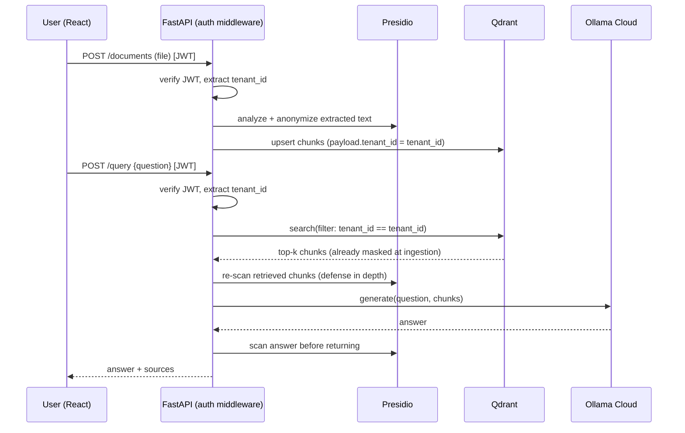

# Architecture

## Request flow



## Module boundaries and contracts

- **Auth layer** (`06-auth.md`) is the *only* place that reads the JWT. It exposes a
  single dependency, e.g. `get_current_tenant(request) -> TenantContext`, and every
  other module receives `TenantContext` as a function argument — never re-derives it.
- **Ingestion pipeline** (`03`) depends on the masking module (`04`) — text is masked
  *before* chunking/embedding, not after.
- **Vector store module** (`05`) exposes exactly two entrypoints: `upsert(tenant_id,
  chunks)` and `search(tenant_id, query_vector, k)`. Both take `tenant_id` as a required
  positional argument with no default — this is a deliberate API smell that forces
  every call site to think about isolation instead of silently omitting it.
- **Generation module** (`07`) is LLM-agnostic behind a small interface
  (`generate(prompt) -> str`) so swapping Ollama Cloud for anything else later is a
  one-file change.

## Data model (conceptual)

```
Tenant
  id, name

Document
  id, tenant_id, filename, status (processing|indexed|failed), uploaded_at

Chunk (stored in Qdrant payload, not a relational table)
  id, tenant_id, document_id, text (masked), vector, masking_applied: bool

QueryLog
  id, tenant_id, user_id, question, masking_triggered: bool, timestamp
```

## Isolation strategy: Pool with hard filter, Silo available as upgrade
Start with **Pool** — one Qdrant collection, `tenant_id` as an **indexed keyword payload
field** so filtering is pushed into the HNSW search (not a post-filter, which degrades
recall and isn't a real security boundary at scale). If the assessment specifically
wants to demonstrate hard/physical isolation, upgrading to **Silo** (one collection per
tenant, same code path, just parameterize the collection name by `tenant_id`) is a small
change — mention this explicitly when presenting, it shows you understand the
isolation-strength tradeoff AWS's own docs call out (filter isolation is logical, not
physical).

## Scalability notes (keep proportionate — this is a prototype)
- Ingestion (parsing/embedding) should be an async background job (FastAPI
  `BackgroundTasks` is enough for a prototype; note Celery/RQ as the production upgrade)
  so upload requests return immediately with `status: processing`.
- Qdrant scales horizontally on its own; nothing in the app should assume a single node.
- Stateless FastAPI instances (no in-memory session state) so it can run behind a load
  balancer with multiple replicas.
